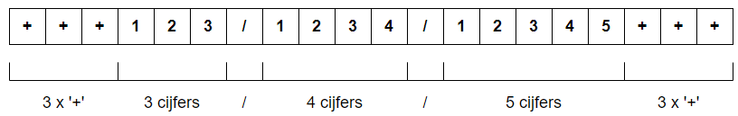

# Oefening 01

In dit project krijg je een lijst van 120 betalingen.  De opdracht bestaat eruit, elke betaling te valideren, met andere woorden, van elke betaling controleer je of de datum geldig is.  

Van elke betaling controleer je:

* of de datum geldig

* het patroon van de gestructureerde mededeling voldoet 

* het controlegetal van de gestructureerde mededeling correct is..  

Voor het valideren van de gestructureerde mededeling maak je gebruik van een 'reguliere expressie' in combinatie met Python-code.

We beogen het volgende resultaat:


## Het bronbestand

Voor deze opdracht maak je gebruik van het bijgevoegde CSV-bestand 'bestalingen.csv'.  Download uit Classroom dit CSV-bestand en kopieer het naar de projectmap.

Op de eerste rij van het bestand staan de kolomtitels 'datum', 'bedrag' en 'mededeling'.  Daarop volgen de gegevens van 120 betalingen.

```textile
datum,bedrag,referentie
15-05-2021,112.4,+++515/9569/59458+++
08-09-2022,227.98,+++394/8275/37755+++
09-03-2022,244.71,+++559/6009/62446+++
26-01-2022,198.34,+++933/2043/93Z44+++
10-04-2022,233.37,+++973/1064/88753+++
12-07-2021,116.49,+++338/1992/94452+++
24-05-2021,141.58,+++930/5198/67048+++
01-09-2021,94.97,+++521/2622/88440+++
```

## Valideren van de datum

De datum kan je valideren aan de hand van de module '*datetime*'.  De datum kan je als volgt valideren

```python
from datetime import datetime

try:
    datetime(jaar, maand, dag)
except ValueError:
    print('foutieve datum')
```

Je maakt hiertoe gebruik van '*datetime*' uit de gelijknamige module '*datetime*'.  Aan de methode '*datetime*' ken je jaartal, maand en dag toe.  De methode vereist voor dag, maand en jaar gehele getallen.

Is de opgegeven combinatie jaartal-maand-dag geen geldige datum, dan wordt er een uitzondering gegenereerd.

De datum van elke betaling in het bronbestand volgt de Europese notatie, namelijk '*dd-mm-yyyy*' in de vorm van een string.

Om met '*datetime*' te kunnen werken zetten we de datum om in een list van integers.  Dit doe je als volgt: splits de string op het scheidingsteken `-`.  Met de functie 'map()' zetten we de bekomen resultaten om in de vereiste gehele getallen.  Met de functie '*list()*' zorgen we ervoor dat het resultaat een list is.

```python
tmp = list(map(int, datum.split('-')))
```

## Gestructureerde mededeling valideren

### Structuur van de gestructureerde mededeling valideren

Eerst valideren we de structuur van de gestructureerde mededeling.  Voor dit valideren maken we gebruik van een reguliere expressie.

Van een gestructureerde mededeling onderscheiden we:

* **+++**: drie opeenvolgende plustekens, de start van een gestructureerde mededeling

* **123**: een eerste getal, bestaat uit precies 3 cijfers

* **/**: een slash die de scheiding vormt tussen het eerste en tweede getal

* **1234**: een tweede getal, bestaat uit precies 4 cijfers

* **/**: een slash die de scheiding vormt tussen het tweede en derde getal

* **12345**: een derde getal, bestaat uit precies 5 cijfers

* ****+++**: drie opeenvolgende plustekens, het einde van de gestructureerde mededeling



We kunnen verschillende reguliere expressies bedenken om de gestructureerde mededeling te valideren.  Hieronder een kandidaat reguliere expressie...

```python
^+{3}\d{3}/\d{4}/\d{5}+{3}$
```

De volledige gestructureerde mededeling moet aan de reguliere expressie voldoen, met andere woorden, we laten geen karakters toe die de gestructureerde mededeling voorafgaan of op de gestructureerde mededeling volgen.  Daarom sluiten we de reguliere expressie in tussen ^ en \$.

De reguliere expressie volgt vervolgens de structuur van de gestructureerde mededeling:

* **+{3}**: exact 3 plus-tekens

* **\d{3}**: precies 3 cijfers

* **/**: een slash

* **\d{4}**: precies 4 cijfers

* **/**: een slash

* **\d{5}**: precies 5 cijfers

* **+{3}**: exact 3 plus-tekens

### Controle getal valideren

Het tweede deel in het valideren van de gestructureerde mededeling is het valideren van het controle getal.

De twee laatste cijfers van de derde cijfergroep is het controle getal van de gestructureerde mededeling.

Uit de overige cijfers (de eerste 10 cijfers van de gestructureerde mededeling) kan je het controle getal berekenen door de van de som van de cijfers modulo 97 te bepalen.

Zijn de berekening en het controle getal gelijk dat is de gestructureerde mededeling geldig, anders niet.


